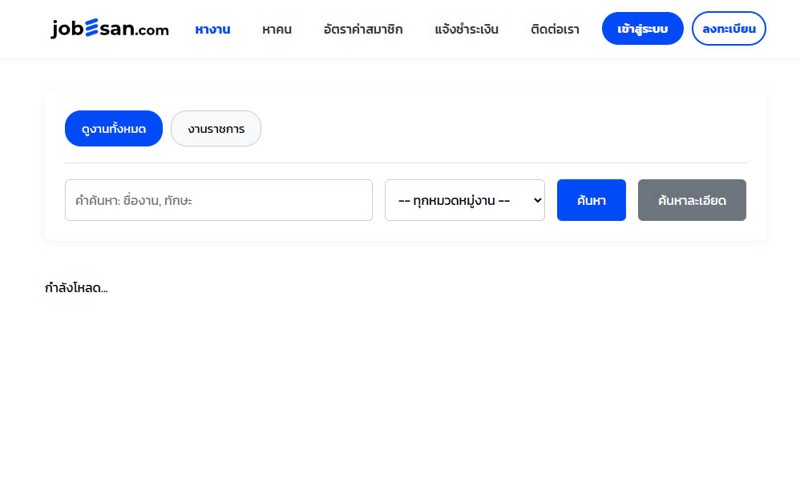
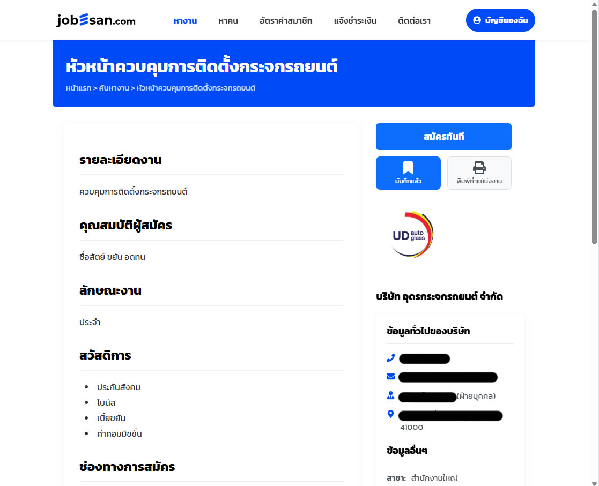
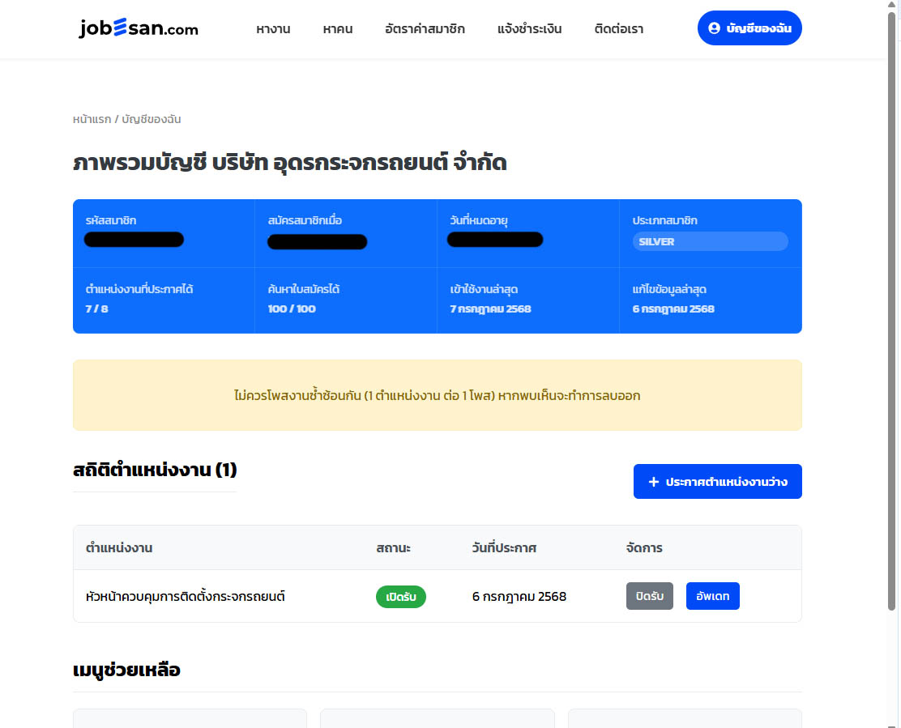

# JOBESAN-APP (เว็บหางานภาคอีสาน) - Full-Stack Application

โปรเจคนี้คือ "Showcase" (ป้ายแสดงผลงาน) สำหรับเว็บแอปพลิเคชันหางาน (Job Board) ที่ฉันพัฒนาขึ้นมาเองทั้งหมด โดยมีเป้าหมายเพื่อเป็นพื้นที่หางาน/รับสมัครงานสำหรับผู้ประกอบการและผู้หางานในโซนภาคอีสานของไทย

> **หมายเหตุ:** โปรเจคนี้เป็น Passion Project ที่ฉันพัฒนาด้วย React และ Supabase (Open Source Firebase Alternative) เพื่อสร้างแพลตฟอร์มแบบ Two-Sided Marketplace (ตลาดสองด้าน) ที่เชื่อมโยงนายจ้างและผู้สมัครงานเข้าด้วยกัน

---

##  STATUS (สถานะโปรเจค)

**พัฒนาเสร็จสิ้นแล้วประมาณ 95%**
* ฟีเจอร์หลัก (ค้นหางาน, สมัครงาน, โพสต์งาน) พัฒนาเสร็จสิ้นและทดสอบแล้ว
* **โปรเจคหยุดชั่วคราว (Paused):** เนื่องจากติดปัญหาเรื่องงบประมาณในการเช่าเซิร์ฟเวอร์เพื่อนำขึ้นออนไลน์จริง (Production)
* **เป้าหมายใน Portfolio:** เพื่อแสดงทักษะการสร้าง Full-Stack Application ที่ซับซ้อนด้วยเทคโนโลยีสมัยใหม่ (React + Supabase)

---

## 1. เป้าหมายของโปรเจค (The Goal)

สร้างแพลตฟอร์ม "หางาน" ที่เน้นกลุ่มเป้าหมายเฉพาะ (Niche) คือ "ภาคอีสาน" เพื่อช่วยให้ผู้หางานทั่วประเทศสามารถหางานในพื้นที่ภาคอีสานได้ง่ายขึ้น และช่วยให้ธุรกิจในท้องถิ่นสามารถหาคนได้ตรงจุด

## 2. Tech Stack ที่ใช้

* **Frontend:** React.js
* **Backend & Database:** Supabase
    * (ใช้ Supabase Auth สำหรับการยืนยันตัวตน, Supabase DB (PostgreSQL) สำหรับเก็บข้อมูลงาน/ผู้สมัคร, และ Row Level Security (RLS) เพื่อความปลอดภัยของข้อมูล)
* **Styling:** (ระบุ CSS Framework ที่คุณใช้ เช่น Tailwind CSS, Material-UI, etc.)

---

## 3. ฟีเจอร์เด่นๆ ที่ฉันทำ (Key Features)

### 🔷 1. สำหรับผู้หางาน (Job Seeker)
* ระบบค้นหางาน และ Filter ตำแหน่งงาน
* สมัครสมาชิก และสร้างโปรไฟล์/อัปโหลดเรซูเม่
* ระบบ "สมัครงาน" (Apply)

### 🔷 2. สำหรับนายจ้าง (Employer)
* สมัครสมาชิกในฐานะ "บริษัท"
* ระบบล็อกอิน และ Dashboard ส่วนตัว
* สร้าง/แก้ไข/ลบ "ตำแหน่งงาน" (Job Posting)
* ดูรายชื่อผู้ที่สมัครงานในตำแหน่งของตนเอง

---

## 4. สิ่งที่ท้าทาย (Challenges)

* **การใช้ Supabase:** เรียนรู้และประยุกต์ใช้ Supabase (ซึ่งเป็นเทคโนโลยีที่ค่อนข้างใหม่) ในโปรเจคจริง
* **Row Level Security (RLS):** การตั้งค่า RLS ใน Supabase (PostgreSQL) ให้ถูกต้องและปลอดภัย เพื่อให้มั่นใจว่า "นายจ้าง A" จะไม่สามารถเห็นข้อมูลผู้สมัครของ "นายจ้าง B" ได้
* **การออกแบบโครงสร้าง (Schema):** การออกแบบฐานข้อมูลสำหรับระบบ Two-Sided Marketplace ที่ต้องเชื่อมโยงข้อมูลระหว่าง "บริษัท", "ตำแหน่งงาน", "ผู้หางาน", และ "การสมัครงาน"

## 5. สิ่งที่เรียนรู้จากโปรเจคนี้ (What I Learned)

* **ทักษะ Full-Stack สมัยใหม่:** มีความเชี่ยวชาญในการสร้างเว็บแอปด้วย React (Frontend) และ Supabase (Backend as a Service)
* **การจัดการ Backend & Database:** ได้เรียนรู้การทำงานกับ PostgreSQL และการเขียน Policy ความปลอดภัย (RLS) ใน Supabase
* **การพัฒนาโปรเจคที่ซับซ้อน:** สามารถวางแผนและพัฒนาเว็บแอปที่มีผู้ใช้งานหลายประเภท (User Roles) และมี Business Logic ที่ซับซ้อนได้ตั้งแต่ต้นจนเกือบจบ